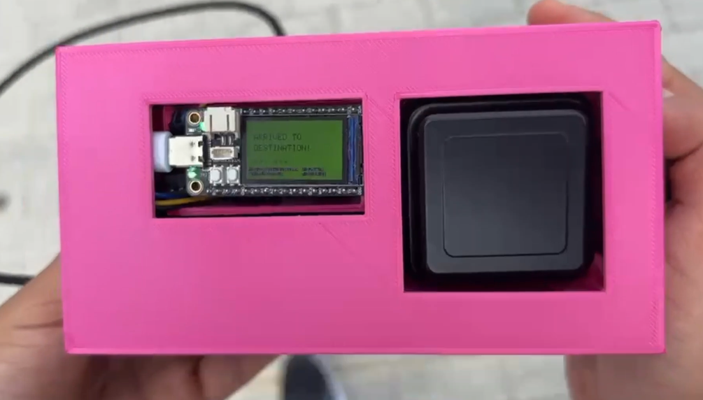

# Sensatex - Off-Grid GPS Rescue Navigation System

An embedded GNSS navigation device built around the ESP32-S3 microcontroller and the Quectel LC29H(AA) dual-band receiver. The device operates as a self-contained Wi-Fi access point, serving a full web application to any connected phone - no internet, no cell towers, no infrastructure required.

Developed during the **STMP26 SENSATE-X 2.0 Short Term Mobility Programme** at TU Dublin, Tallaght Campus.

---

## Physical Prototype

<p align="center">
  
</p>

<p align="center">
  <em>Assembled prototype: TenStar ESP32-S3 with TFT dashboard, Quectel LC29H(AA) GNSS module, and external patch antenna housed in a custom 3D-printed enclosure. The TFT screen displays live PVT (Position, Velocity, Time) telemetry and a directional navigation arrow.</em>
</p>

---

## Table of Contents

- [Overview](#overview)
- [System Architecture](#system-architecture)
- [Hardware](#hardware)
- [Communication Approach Evolution](#communication-approach-evolution)
- [Firmware - AP Program](#firmware--ap-program)
- [Web Application](#web-application)
- [Map Generator](#map-generator)
- [3D-Printed Enclosure](#3d-printed-enclosure)
- [Technical Highlights](#technical-highlights)
- [Project Structure](#project-structure)
- [Getting Started](#getting-started)
- [Wiring Diagram](#wiring-diagram)
- [License](#license)

---

## Overview

Sensatex is designed for scenarios where conventional navigation infrastructure is unavailable: natural disasters, remote wilderness areas, conflict zones, or any situation where a user needs directional guidance without relying on cellular networks or cloud services.

The system provides:

- **Real-time GNSS positioning** via the LC29H(AA) multi-constellation receiver (GPS, Galileo, GLONASS, BeiDou)
- **On-device TFT dashboard** showing position, velocity, time, satellite count, HDOP, and a directional arrow pointing toward the target
- **Self-hosted web interface** served over a local Wi-Fi access point - any phone with a browser can connect and interact with the device
- **Off-grid compass navigation** with live bearing, distance, and heading indicators rendered as an SVG compass on the phone
- **Coordinate system support** for Decimal Degrees, DMS (Degrees/Minutes/Seconds), and UTM with full bidirectional conversion
- **Persistent location storage** using the browser's localStorage, surviving page reloads and reconnections

---

## System Architecture

```
┌─────────────────────────────────────────────────────────────┐
│                    SENSATEX DEVICE                          │
│                                                             │
│  ┌──────────────┐   UART 115200    ┌──────────────────┐    │
│  │  LC29H(AA)   │ ──────────────── │   ESP32-S3       │    │
│  │  GNSS Module │   TX→GPIO17      │   TenStar Board  │    │
│  │              │   RX→GPIO18      │                  │    │
│  │  External    │                  │  ┌────────────┐  │    │
│  │  Patch       │                  │  │  ST7789    │  │    │
│  │  Antenna     │                  │  │  TFT 240×  │  │    │
│  └──────────────┘                  │  │  135 LCD   │  │    │
│                                    │  └────────────┘  │    │
│                                    │                  │    │
│                                    │  Wi-Fi Soft AP   │    │
│                                    │  192.168.4.1     │    │
│                                    └──────────────────┘    │
│                                             │              │
└─────────────────────────────────────────────│──────────────┘
                                              │ HTTP
                                              │
                                    ┌─────────▼──────────┐
                                    │   Phone / Tablet   │
                                    │                    │
                                    │  Browser connects  │
                                    │  to 192.168.4.1    │
                                    │                    │
                                    │  Full web app:     │
                                    │  - SVG Compass     │
                                    │  - Location mgmt   │
                                    │  - Live GPS data   │
                                    └────────────────────┘
```

---

## Hardware

| Component | Model | Role |
|---|---|---|
| Microcontroller | TenStar TS-ESP32-S3 | Main processing unit, Wi-Fi AP, TFT host, web server |
| GNSS Receiver | Waveshare LC29H(AA) (Quectel) | Dual-band multi-constellation GNSS receiver |
| Antenna | External active patch antenna | Required for satellite acquisition (SMA connector) |
| Display | Built-in ST7789 TFT (240 x 135) | On-device PVT dashboard and navigation arrow |
| Status LED | Onboard WS2812 NeoPixel | Visual fix/navigation status indicator |
| Enclosure | Custom 3D-printed (PLA) | Two-piece box housing both modules and antenna |

The LC29H(AA) is powered independently via its own USB cable, not from the ESP32, ensuring stable power delivery to both modules. Communication between them is through a 3-wire UART connection (TX, RX, GND).

---

## Communication Approach Evolution

The final architecture was reached through an iterative design process, evaluating three different communication strategies between the microcontroller and the user's phone:

### 1. Hardcoded Coordinates (`Hardcoded_Program/`)

The initial approach hardcoded a fixed target latitude and longitude directly in the firmware. While simple and useful for verifying that GNSS parsing and TFT rendering worked correctly, it offered zero flexibility - changing the destination required reflashing the entire board.

### 2. Bluetooth Low Energy (`BLE_Program/`)

The second iteration introduced BLE communication. The ESP32 advertised a GATT service, and a companion app could write a destination index to a characteristic. This worked but had significant drawbacks:

- Required a dedicated BLE app (not just a browser)
- Limited to predefined destination indices rather than arbitrary coordinates
- BLE pairing and reconnection added complexity and fragility in the field

### 3. Wi-Fi Access Point - Final Architecture (`AP_Program/`)

The final and adopted solution uses the ESP32 as a **Wi-Fi Soft Access Point**. The device creates its own network (`Sensatex_Emergency`, open for immediate access) and runs a full HTTP web server. Any phone connects to the network and navigates to `192.168.4.1` in a standard browser - no app installation required.

This approach eliminates all external dependencies. The entire web application (HTML, CSS, JavaScript) is embedded in the firmware using `PROGMEM` raw string literals and served directly from flash memory.

---

## Firmware - AP Program

The production firmware (`NMEA_Reader/AP_Program/AP_Program.ino`) is a single-file Arduino sketch (~2300 lines) that integrates:

### GNSS Engine
- Reads raw NMEA 0183 sentences from the LC29H(AA) over UART1 at 115200 baud (8N1)
- Parses `$GN`-prefixed multi-system sentences using the TinyGPS++ library
- Extracts position, velocity, time, satellite count, and HDOP in a non-blocking loop
- Computes great-circle distance (Haversine) and initial bearing to the target using `TinyGPSPlus::distanceBetween()` and `TinyGPSPlus::courseTo()`

### TFT Dashboard
- Renders to the built-in ST7789 display in landscape mode (rotation 3)
- Displays a directional arrow using trigonometric vector math and the Bresenham-based `drawLine` primitive
- Shows a PVT telemetry bar at the bottom: lat/lon, speed (km/h), UTC time, satellite count, HDOP
- Uses non-blocking 1-second refresh intervals to prevent flicker while continuously reading GPS bytes

### Navigation Logic
- Computes relative bearing (target bearing minus current heading) for a turn-indicator arrow
- Heading is derived from GPS Course Over Ground, only updated when speed exceeds 0.8 km/h to suppress stationary noise
- Last known heading is held indefinitely to maintain arrow direction even when stopped
- Arrival detection triggers a full-screen green confirmation when within 20 m of the target

### NeoPixel Status
- **Dim blue**: Booting / waiting for fix
- **Orange**: Navigating (fix acquired, en route)
- **Green**: Arrived at destination

### Web Server
- Soft AP created with `WiFi.softAP()` on the default `192.168.4.1` address
- HTTP routes serve the embedded web application:
  - `GET /` - HTML page
  - `GET /style.css` - CSS stylesheet
  - `GET /app.js` - JavaScript application
  - `GET /gps` - JSON endpoint returning live `{ valid, lat, lon, heading, speed }`
  - `GET /set?lat=...&lon=...&name=...` - Sets a new navigation target dynamically
- `server.handleClient()` is called every loop iteration alongside GPS parsing

---

## Web Application

The web application (`website/`) is a self-contained mobile-first interface with no external dependencies other than Google Fonts. It is embedded in the firmware but also available as standalone files for development.

### Features

- **SVG Compass**: A dynamically rendered compass with smooth heading interpolation, cardinal indicators, degree tick marks, and an animated directional arrow pointing toward the active target
- **Location Management**: Add, save, delete, and navigate to locations. Locations persist in `localStorage`
- **Multi-format Coordinate Input**: Supports Decimal Degrees (lat/lon), DMS, and UTM. The UTM-to-lat/lon conversion implements the inverse transverse Mercator projection based on Karney (2011) with WGS84 ellipsoid constants
- **Real-time ESP32 Communication**: Polls the `/gps` endpoint every second to override the phone's GPS with the high-precision GNSS data from the LC29H(AA). Falls back to the phone's own `navigator.geolocation` when disconnected
- **Device Orientation**: Uses the `DeviceOrientationEvent` API (with iOS 13+ permission handling) for magnetometer-based heading. When unavailable (HTTP context), falls back to GPS Course Over Ground from the ESP32
- **Haversine Calculations**: Distance and bearing computed client-side using the Haversine formula (`R = 6,371,000 m`)
- **Glassmorphism Design**: Dark theme with backdrop blur, gradient accents, and micro-animations

### Tech Stack

| Layer | Technology |
|---|---|
| Markup | HTML5 semantic elements |
| Styling | Vanilla CSS with CSS custom properties, glassmorphism, keyframe animations |
| Logic | Vanilla JavaScript (no frameworks, no build step) |
| Fonts | Inter (UI), JetBrains Mono (data/coordinates) |
| Storage | `localStorage` for persistent location data |

---

## Map Generator

`map_generator.py` is a Python utility for downloading and stitching OpenStreetMap tiles into high-resolution JPEG images for offline use. It supports configurable zoom levels, bounding boxes, and aspect ratio correction.

```bash
pip install pillow requests
python map_generator.py
```

The script outputs tile boundary coordinates in a format ready to be pasted into code, and applies rate limiting to respect OSM's tile usage policy.

---

## 3D-Printed Enclosure

The `3D Models/` directory contains STL files for the custom enclosure:

| File | Description |
|---|---|
| `Box.STL` | Main body housing the ESP32-S3 and GNSS module |
| `TOP1.STL` | Top lid with cutouts for the TFT display and antenna placement |

The enclosure was designed to securely hold both modules side by side, with the TFT screen and USB ports accessible through the front panel and the antenna mounted on the adjacent compartment.

---

## Technical Highlights

### Embedded Web Serving via PROGMEM
The entire web application (~30 KB HTML + CSS + JS) is stored in flash memory using C++ raw string literals (`R"rawliteral(...)rawliteral"`) and served using `server.send_P()`, which reads directly from program memory without copying to RAM - critical on a microcontroller with limited SRAM.

### Non-blocking Architecture
The main `loop()` runs three concurrent tasks without threads or RTOS:
1. GPS byte ingestion (`GPSSerial.available()` + `gps.encode()`)
2. HTTP client handling (`server.handleClient()`)
3. Timer-based TFT refresh (every 1000 ms)

No task blocks the others. GPS data is stored in global state variables immediately upon reception and consumed by the display on its own schedule.

### Heading Noise Suppression
GPS Course Over Ground is only valid when the receiver is moving. At rest, it produces random values. The firmware applies a speed gate (0.8 km/h threshold) and holds the last valid heading indefinitely, ensuring the directional arrow remains stable when the user stops walking.

### UTM Coordinate Conversion
The web application implements a full inverse transverse Mercator projection with fourth-order Fourier series coefficients, using the WGS84 ellipsoid parameters (`a = 6,378,137 m`, `f = 1/298.257223563`). This allows field personnel to input coordinates from military or topographic maps directly.

### Dual GPS Source with Fallback
When connected to the ESP32's Wi-Fi network, the web app polls the `/gps` endpoint and uses the LC29H(AA)'s position data, which is more precise than a phone's built-in GPS. When disconnected from the device (e.g., for standalone use), it transparently falls back to the phone's `navigator.geolocation` API.

---

## Project Structure

```
Sensatex/
├── NMEA_Reader/
│   ├── AP_Program/              # Production firmware (Wi-Fi AP + Web Server)
│   │   └── AP_Program.ino
│   ├── BLE_Program/             # Iteration 2: Bluetooth Low Energy approach
│   │   └── BLE_Program/
│   │       └── BLE_Program.ino
│   └── Hardcoded_Program/       # Iteration 1: Fixed coordinates approach
│       └── Hardcoded_Program.ino
├── website/                     # Standalone web application (also embedded in AP_Program)
│   ├── index.html
│   ├── style.css
│   └── app.js
├── 3D Models/
│   ├── Box.STL                  # Enclosure body
│   └── TOP1.STL                 # Enclosure lid
├── resources/
│   ├── Assembled_Device.png     # Physical prototype photo
│   └── Dublin.jpg               # Map reference image
├── map_generator.py             # Offline map tile downloader
├── INSTRUCTIONS.txt             # Lab hardware/wiring reference
└── README.md
```

---

## Getting Started

### Prerequisites

- [Arduino IDE 2.x](https://www.arduino.cc/en/software) with the **Espressif ESP32** board package installed
- USB-C cable for the TenStar ESP32-S3
- Micro-USB cable for the LC29H(AA) GNSS module (separate power)

### Arduino IDE Configuration

| Setting | Value |
|---|---|
| Board | ESP32S3 Dev Module |
| USB CDC On Boot | Enabled |
| Board Package | Espressif ESP32 (not the Arduino fork) |

### Required Libraries

Install via the Arduino Library Manager:

| Library | Purpose |
|---|---|
| TinyGPSPlus | NMEA sentence parsing |
| Adafruit GFX | Core graphics primitives |
| Adafruit ST7789 | TFT display driver |
| Adafruit NeoPixel | Onboard LED control |

### Flashing

1. Connect the ESP32-S3 via USB-C
2. Open `NMEA_Reader/AP_Program/AP_Program.ino` in Arduino IDE
3. Select the correct COM port under **Tools > Port**
4. Click **Upload**
5. Connect the LC29H(AA) via its own USB cable
6. Press the **RST** button on the board if the sketch does not start automatically

### Connecting

1. On your phone, connect to the Wi-Fi network **`Sensatex_Emergency`** (no password)
2. Open a browser and navigate to **`192.168.4.1`**
3. The web application will load with a compass, location management, and live GPS data

---

## Wiring Diagram

```
LC29H(AA) GNSS Module          ESP32-S3 TenStar Board
┌─────────────────┐            ┌─────────────────────┐
│                 │            │                     │
│  GND ───────────│── Black ──│── GND               │
│  TX  ───────────│── Yellow ─│── GPIO 17 (RX)      │
│  RX  ───────────│── Blue ──│── GPIO 18 (TX)      │
│                 │            │                     │
│  USB (power)    │            │  USB-C (power+prog) │
└─────────────────┘            └─────────────────────┘
```

### Pin Assignments

```c
#define GPS_RX         17    // UART1 receive from LC29H TX
#define GPS_TX         18    // UART1 transmit to LC29H RX
#define TFT_CS          7    // SPI chip select
#define TFT_DC         39    // Data/Command
#define TFT_RST        40    // Hardware reset
#define TFT_BACKLIGHT  45    // Must be HIGH before tft.init()
#define SPI_SCK        36    // SPI clock
#define SPI_MISO       37    // SPI data in
#define SPI_MOSI       35    // SPI data out
#define LED_PIN        33    // NeoPixel data
```

---

## License

This project was developed as part of an academic mobility programme. See the repository for licensing details.
